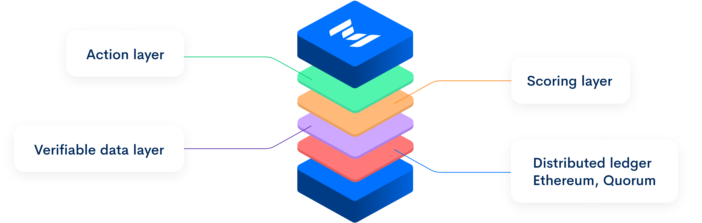
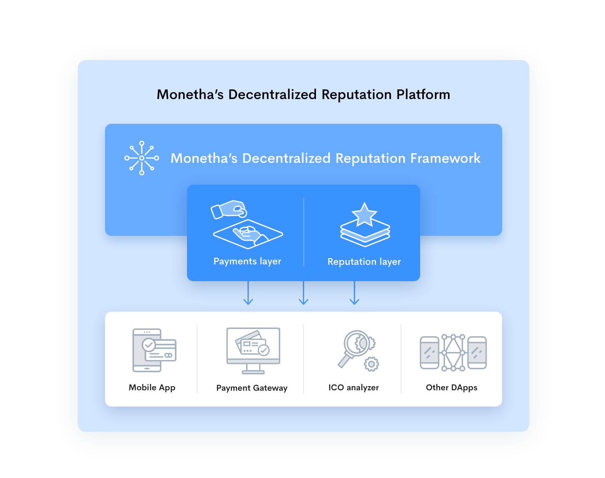

# MONETHA: Decentralized Reputation Framework

We are aiming to increase the confidence and probability of success for any interaction between parties. The Framework is the foundation for Monetha's Decentralized Reputation Platform which allows to make payments and build a censorship resistant and transferable reputation that is reliable and based on the user's behavior.

The Framework enables its users to securely store relevant information about a person or thing and lets them access it before initiating a transaction. That way they can evaluate how trustworthy the other party is in order to confidently meet their expectations.

#### Key Principles

- **Censorship resistant**: the framework is secure, immune to a single point of control or failure.

- **Universal**: user data (incl. reputation insights) is not tied to a single service provider – it can be used everywhere.

- **Transferable**: once established, the reputational data can be effortlessly moved across various platforms or service providers.

- **Transparent**: all interactions with the framework are public and can be verified by anyone.

- **Secure**: safe for storage and exchange of sensitive information. 

#### Framework Layers

#### Implementation
- Action (Payment) layer: https://github.com/monetha/payment-layer;
- Reputation layer: https://github.com/monetha/reputation-layer;

## Monetha Platform
Our platform utilizes framework capabilities to deliver solution for e-commerce participants.

#### Applications
* Mobile Wallet to perform payments and manage reputation profile: 
  * iOS - https://itunes.apple.com/us/app/monetha/id1351311808
  * Android - https://play.google.com/store/apps/details?id=com.monetha.app;
* Payment gateway to facilitate ETH payments: https://www.monetha.io/e-commerce;
* dApp "ICO analyzer" to store censorship resistant reputation of any ICO: 
  * Website: https://icoanalyzer.monetha.io
  * Source code: https://github.com/monetha/ico-analyzer-web-app
