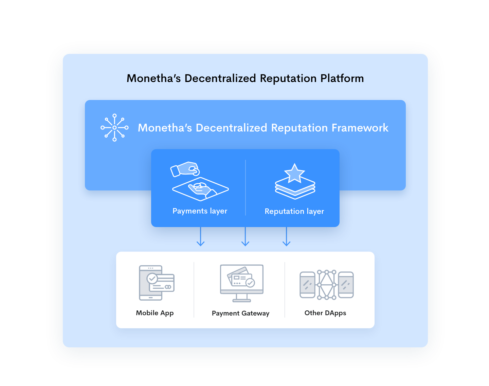

# MONETHA: Decentralized Reputation Framework

We are aiming to increase the confidence and probability of success for any interaction between parties. The Framework is the foundation for Monetha's Decentralized Reputation Platform which allows to make payments and build a censorship resistant and transferable reputation that is reliable and based on the user's behavior.

The Framework enables its users to securely store relevant information about a person or thing and lets them access it before initiating a transaction. That way they can evaluate how trustworthy the other party is in order to confidently meet their expectations.

## Key Principles

- Censorship resistant: the Framework is secure, immune to a single point of control or failure.

- Universal: the reputation is not tied to a single website or service – it can be used everywhere.

- Transferable: once established, the reputation can be effortlessly moved across various platforms.

- Transparent: save for sensitive information, all interactions are public and can be verified by anyone.

## Framework Components

### Framework

- Payments layer: https://github.com/monetha/payment-layer;
- Reputation layer: https://github.com/monetha/reputation-layer;

### Example applications
* Mobile apps: 
  * iOS - https://itunes.apple.com/us/app/monetha/id1351311808
  * Android - https://play.google.com/store/apps/details?id=com.monetha.app;
* Payment gateway: https://www.monetha.io/e-commerce;
* ICO analyzer: 
  * Website: https://icoanalyzer.monetha.io
  * Source code: https://github.com/monetha/ico-analyzer-web-app
